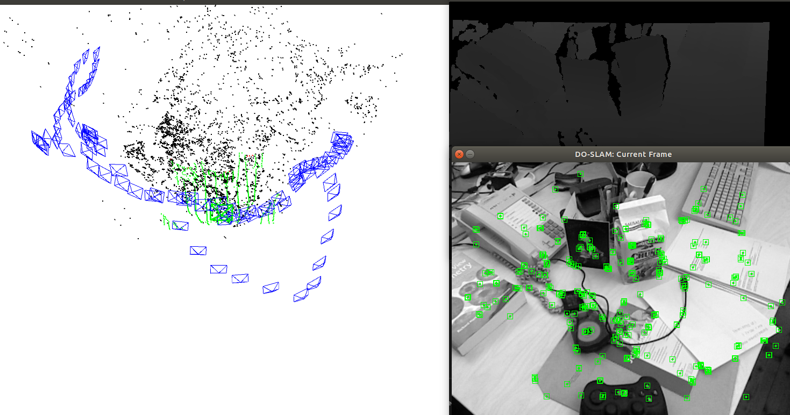
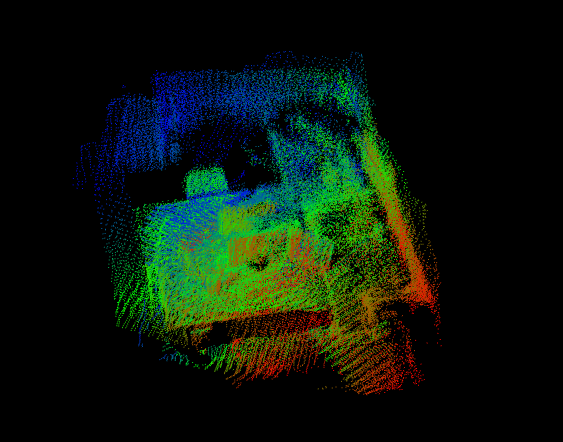
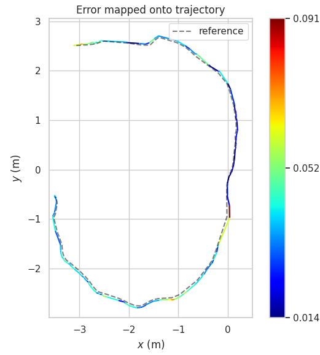
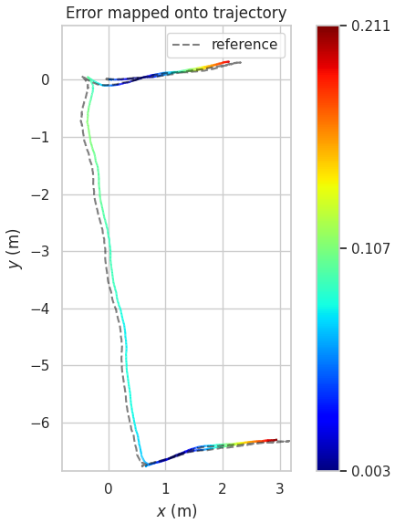

# DO-SLAM

## build:

### build the whole project ( inclouding binary loading tools ):

build with library

```bash
     cd YourDirectory/DO-SLAM
     chmod +x build.sh
     ./build.sh
```

### only build

```bash
    cd YourDirectory/DO-SLAM
    mkdir build
    cd build
    cmake ..
    make -j
```

## Run:

```bash
    ./run/rgbd_tum config/ORB.txt path_to_settings path_to_sequence path_to_association
```
 


## 数据集
 

